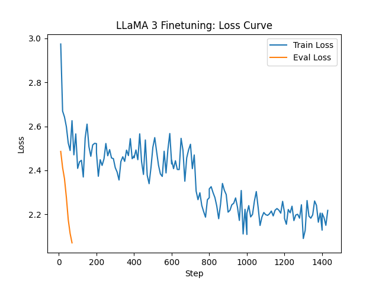

# 🦙 FinLLama — Finetuning LLaMA 3 (8B) on Financial QnA with Unsloth

This repo contains the Kaggle notebook, evaluation metrics, and output from finetuning [`unsloth/llama-3-8b-bnb-4bit`](https://huggingface.co/unsloth/llama-3-8b-bnb-4bit) on the [`finance-alpaca`](https://huggingface.co/datasets/gbharti/finance-alpaca) dataset using **LoRA** via **Unsloth**.

---

## 📊 Training Metrics

| Step | Training Loss | Validation Loss |
| ---- | ------------- | --------------- |
| 200  | 2.5216        | 2.48599         |
| 400  | 2.4523        | 2.41180         |
| 600  | 2.4949        | 2.36138         |
| 800  | 2.2113        | 2.27713         |
| 1000 | 2.1712        | 2.17486         |
| 1200 | 2.2173        | 2.11200         |
| 1400 | 2.1825        | **2.06946**     |



* 🔢 **Final Validation Loss:** \~**2.07**
* ⏱️ **Total Training Time:** \~2.5 hours (on free Kaggle GPU)
* 📦 **Trainable Parameters (LoRA):** \~41M / 8B (\~0.52%)

---

## 🧠 Model Details

* **Base Model**: [`unsloth/llama-3-8b-bnb-4bit`](https://huggingface.co/unsloth/llama-3-8b-bnb-4bit)
* **LoRA Adapter**: [`kenzi123/finllama-lora`](https://huggingface.co/kenzi123/finllama-lora)

> ⚠️ Due to storage limitations on Colab/Kaggle, the **merged 16-bit model** could not be pushed.
> ✅ The **LoRA adapter** is publicly available and can be loaded with the base model.

---

## 🚀 Usage

```python
from unsloth import FastLanguageModel
from transformers import AutoTokenizer

# Load base model
model, tokenizer = FastLanguageModel.from_pretrained(
    model_name = "unsloth/llama-3-8b-bnb-4bit",
    max_seq_length = 2048,
    load_in_4bit = True,
    device_map = "auto",
)

# Load LoRA adapter
model.load_adapter("kenzi123/finllama-lora")

# Run inference
prompt = "<|begin_of_text|><|start_header_id|>user<|end_header_id|>\n\nwhats the future of quant finance?<|eot_id|><|start_header_id|>assistant<|end_header_id|>\n\n"
inputs = tokenizer(prompt, return_tensors="pt").to(model.device)
outputs = model.generate(**inputs, max_new_tokens=100)
print(tokenizer.decode(outputs[0]))
```

---

## 💻 Hosting Note

> ⚠️ **Why no live demo?**
> I attempted to deploy a Gradio demo via Hugging Face Spaces, but it failed due to **no GPU support** on the free tier.

```
RuntimeError: Found no NVIDIA driver on your system.
```

As I currently don't have the budget for paid GPU or storage resources, I’ve only shared the **LoRA adapter** and not the full merged model.

---

## 🧑‍💻 Author

**Hindol R. Choudhury**
*MLOps • LLM Infra • NLP • Applied AI*
📫 [LinkedIn →](https://www.linkedin.com/in/hindol-choudhury/)

---
